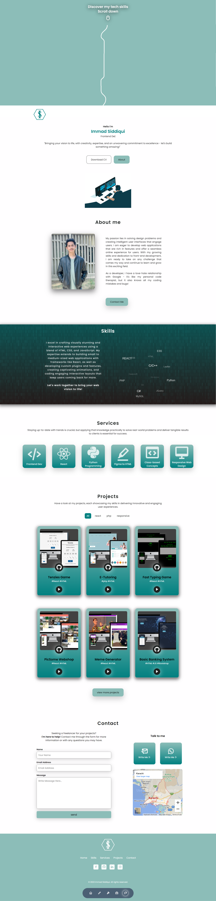

<h1 align="center">Portfolio Website</h1>

<h2 align="center">
<a href="https://immadsidd.github.io/xyz/index.html">Demo</a>
</h2>

## Built With
<ul>
   <li> HTML </Li>
   <li> CSS </li>
   <li> Javascript </li>
   <li> Formspree, a backend-endabled email delivery service provided by a third-party. </li>
   <li> Api.whatsapp, allows chat initation without saving phone numbers in contacts. </li>
</ul>

## Features
<ol>
   <li> Preloader</Li>
   <li> Custom logo  </li>
   <li> A High-Quality Image </li>
   <li> Information About Yourself </li>
   <li> Content </li>
   <li> Your Best Projects </li>
   <li> Filter Projects </li>
   <li> Skills</Li>
   <li> Services  </li>
   <li> Contact Information </li>
   <li> Relevant Social Media Accounts </li>
   <li> Respomsive </li>
   <li> Menu location indicator </li>
</ol>

## Portfolio Sections    
✔️ Header  
✔️ About  
✔️ Skills 
✔️ Services 
✔️ Projects 
✔️ Contact 
✔️ Footer

## This is how it looks:

